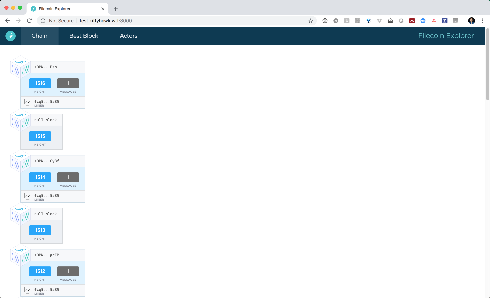
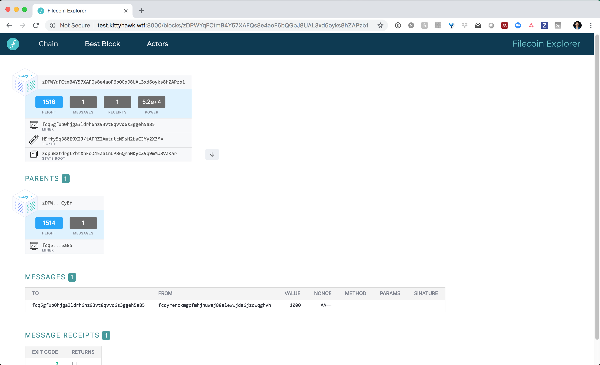

<!---
title: "Block Explorer"
weight: 50
pre: "<i class='fas fa-fw fa-cubes'></i> "
--->

The Filecoin block explorer is a great way to explore blocks that have been mined on the Filecoin network. It shows a constantly updating list of blocks (currently being mined on the Filecoin devnet). You can click into each block to see block details, such as the miner's address, the parent block, messages included in the block, and message receipts.

You can check the block explorer here: http://user.kittyhawk.wtf:8000/

#### Home Page

### Diving into one block

